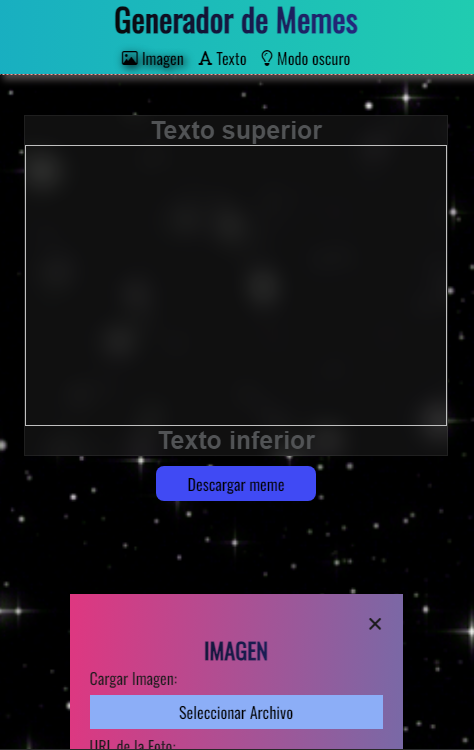

# Generador de MEMES

En este proyecto de [GENERADOR DE MEMES](https://meliegalaz.github.io/creadorMemes/ ) se ingresa un imagen y la transforma en un meme agregando texto, color, filtros y se descarga para guardarla. 

## Descripción
Aca se puede ver al ingresar a la aplicación desde un teléfono en primer lugar el título de la misma el cual va cambiando su color.
Después tres botones, los primeros dos (imagen y texto) abren los paneles para realizar cambios y el tercer botón (modo oscuro) cambia el color de toda la app a color más oscuro.
En el centro se encuentra el lugar donde se cargará la imagen que queramos transformar en meme con sus respectivos textos (inferior y superior).
Abajo de este contenedor se encuentra el botón para descagar el meme una vez que se hayan realizado cada cambio que se desee.
Y para finalizar el pie de página donde se encuentra el nombre de quien realizó esta app.
Toda la app tanto en modo claro como en modo oscuro tiene un color que va cambiando y posee un fondo animado de estrellas.

## CAMBIOS EN LA DISPOSICIÓN SEGÚN EL TAMAÑO DE DISPOSITIVO
 Esta app esta programa para ser usada en cualquier dispositivo dependiendo el tamaño de estos tendrá dos diferentes posiciones de los paneles 

TAMAÑO CELULAR

TAMAÑO DESKTOP

## MODO OSCURO

Para mayor comodidad del usuario se colocó un botón para cambio a modo oscuro o modo claro.

MODO OSCURO

MODO CLARO

## PANEL EN CELULAR
En tamaño celular la pantaña al inicio no tiene scroll solo se puede visualizar el menu el cuadrado para carga de foto, el botón de descarga y el pie de página.Una vez que se selecciona imagen o texto se abre el panel seleccionado y ya nuestra pantalla de dispositivo tendrá scroll, los paneles pasan por debajo de la foto que estamos editando asi nunca se pierde de vista y podemos ir visualizando como van quedando los cambios que le colocamos.
Al tocal el cierre del panel (x) nuestra app vuelve al tamaño inicial sin el scroll.

Al abrir panel

Panel pasando por debajo de imagen

## PANEL EN DESKTOP

Al usar la app en desktop la disposición al inicio es la misma que es celular

Pero los paneles al ser selecionados se colocan a la derecha de la pantalla ocupando desde arriba hasta abajo todo ese espacio.

## PANELES
## TEXTO

En este panel se pueden editar los textos que va a llevar el meme y tiene los siguientes componentes.

- Cierre del panel(x)

- Título TEXTO

- Texto superior: acá cambiamos el texto de arriba del meme

- Texto inferior: acá cambiamos el texto inferior del meme

- checkbox para eliminar por separado el texto superior o inferior, además elimina el espacio que estos ocupan

- Fuentes: cambiar el estilo de la letra

- 25: acá se cambia el tamaño de la letra

- Tres botones para cambiar la posición del texto a la derecha, centro o a la izquierda

- Color: cambia el color de la letra

- Fondo:cambia el fondo del texto

- Checkbox para que tenga fondo transparente

- Contorno:tres botones para que tenga contorno claro, oscuro o ninguno

- Espaciado: para darle separación entre las letras

- Interlineado:para darle separación entre las lineas de texto

## IMAGEN
En este panel se pueden editan la imagen que carguemos y tiene los siguientes componentes.

- Checkbox para cerrar el panel
- Título  IMAGEN
- Cargar imagen desde galeria
- URL para pagar foto copiando desde google o pagina externa
- Fondo : coloca fondo de color a la foto
- Boton(ninguno): hace una mezcla de color de fondo y la foto  utilizando  8 filtros blendMode 
- Filtros:
        - Brillo

        - Opacidad

        - Contraste

        - Desenfoque

        - Escala de grises
        
        - Sepia

        - Hue

        - Saturado

        - Negativo

- Boton para reestablecer los filtros         

## Construido Con 

Las tecnologías que utilize para construir este proyecto:

- Maquetado HTML
-  Estilos CSS
-  Funcionalidad  JAVASCRIPT

## Autor

-  ** MELIE GALAZ **

## Link para usar la app

https://meliegalaz.github.io/creadorMemes/ 

